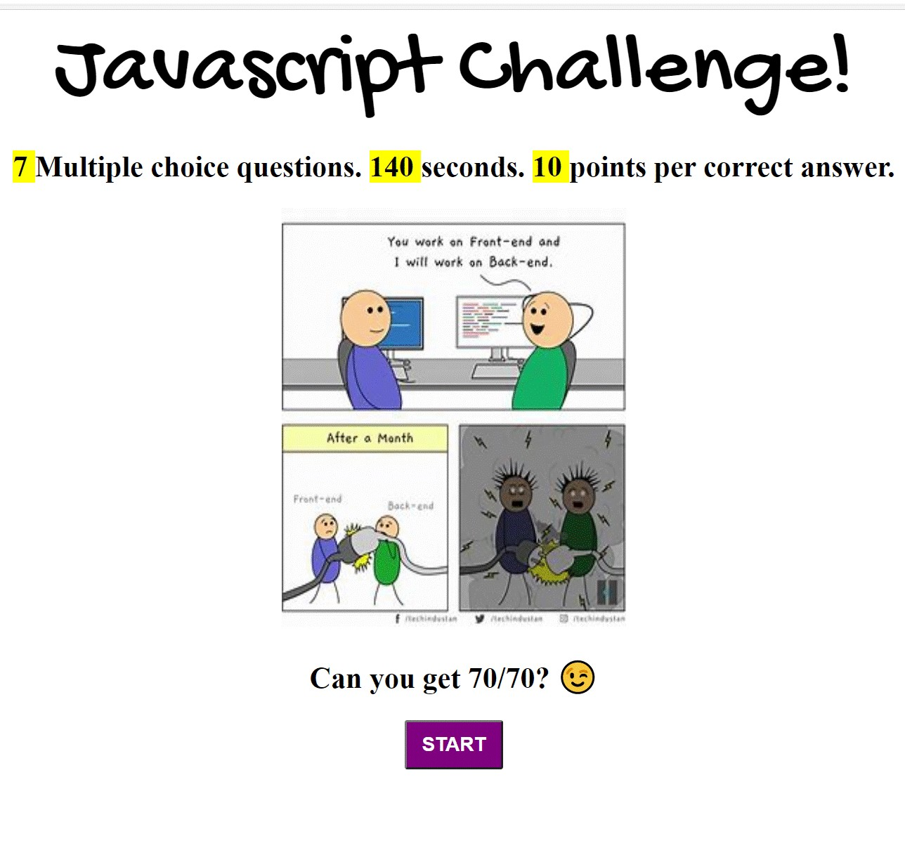
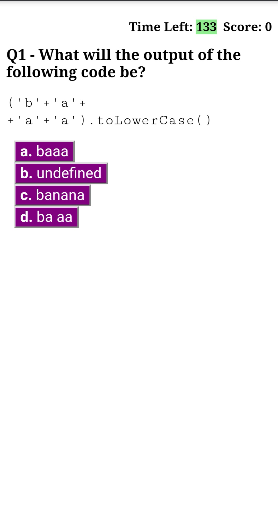
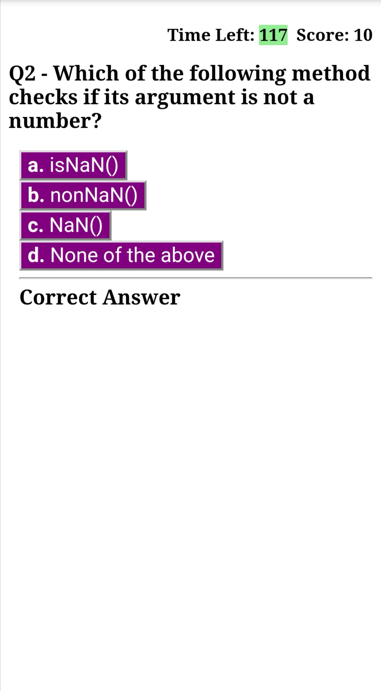
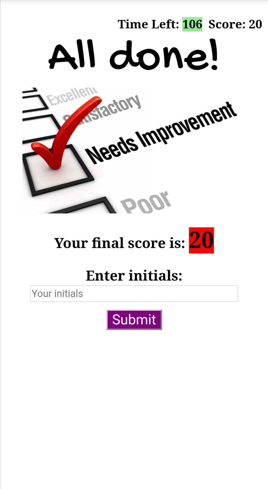
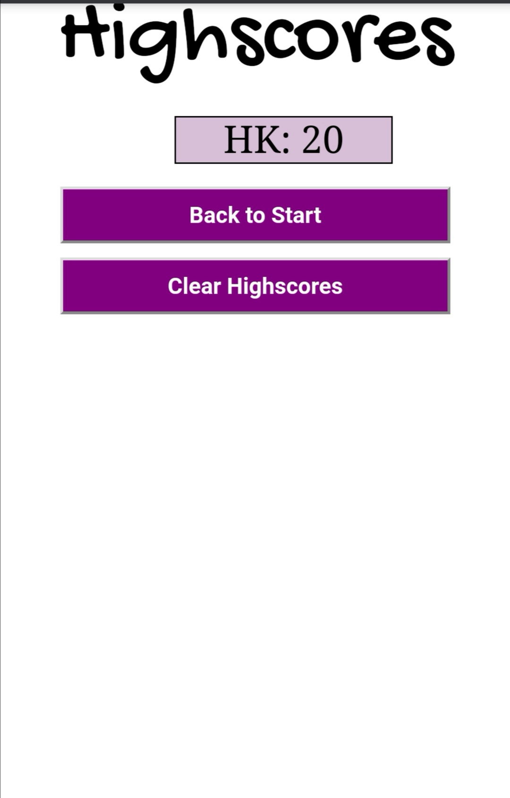

# Code Quiz 

## User Story

AS A coding bootcamp student
I WANT to take a timed quiz on JavaScript fundamentals that stores high scores
SO THAT I can gauge my progress compared to my peers

## Description

This is a timed code quiz with multiple choice questions. It has the following features: 
- Dynamically updated HTML & CSS powered by JavaScript
- Client-side storage
- Responsiveness

## Tools & Technologies 
- Advanced JavaScript

## Visuals

## Project Status 

Completed!

## <a href="https://prabhm512.github.io/code-quiz/"> Deployed Project (click to view)</a>

